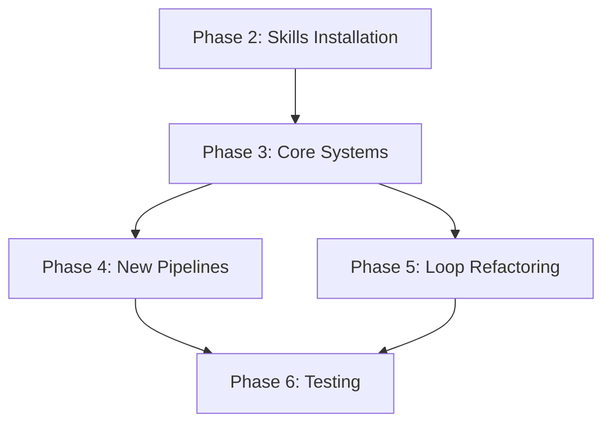

# Multi-Agent Skills & Workflow Enhancement System
## Implementation Plan Document

**Date**: 2026-01-23  
**Status**: Draft  
**Version**: 1.0

---

## Executive Summary

This document outlines the implementation plan for enhancing the Pikar AI platform with:
1. 57 new external skills integrated into the skills registry
2. Financial Model Creation Pipeline
3. Dynamic Custom Skill Creation System
4. Loop-based workflow conversions
5. User-specific dynamic workflow storage
6. Per-user Executive Assistant instances
7. New marketing pipelines (Landing Page, Form Creation)

---

## 1. Architecture Overview

### Current State
```
┌─────────────────────────────────────────────────────────────────┐
│                        ExecutiveAgent                           │
│               (Chief of Staff - Orchestrator)                   │
└────────────────────────────┬────────────────────────────────────┘
                             │ delegates to
┌────────────────────────────┴────────────────────────────────────┐
│                    10 Specialized Agents                        │
│  FIN | CONT | STRAT | SALES | MKT | OPS | HR | LEGAL | SUPP | DATA │
└─────────────────────────────────────────────────────────────────┘
                             │ use
┌────────────────────────────┴────────────────────────────────────┐
│              SkillsRegistry (24 skills)                         │
│          AgentID mapping for skill access                       │
└─────────────────────────────────────────────────────────────────┘
                             │ execute
┌────────────────────────────┴────────────────────────────────────┐
│                  53 Workflow Pipelines                          │
│      Sequential | Parallel | Loop | Dynamic                     │
└─────────────────────────────────────────────────────────────────┘
```

### Target State
```
┌─────────────────────────────────────────────────────────────────┐
│                 Per-User ExecutiveAgent                         │
│          (Personalized Chief of Staff per user)                 │
│       └── Business context + custom system prompt               │
└────────────────────────────┬────────────────────────────────────┘
                             │
┌────────────────────────────┴────────────────────────────────────┐
│                    10 Specialized Agents                        │
│  + skill-creator capability for custom skill generation         │
└─────────────────────────────────────────────────────────────────┘
                             │
┌────────────────────────────┴────────────────────────────────────┐
│              Enhanced SkillsRegistry                            │
│   • 81 skills (24 existing + 57 new)                           │
│   • Custom Skills Store (user-specific)                         │
│   • Skill Creator System                                        │
└─────────────────────────────────────────────────────────────────┘
                             │
┌────────────────────────────┴────────────────────────────────────┐
│              Enhanced Workflow System                           │
│   • 56+ Workflow Pipelines                                      │
│   • User-specific workflow storage & retrieval                  │
│   • Loop-based refinement for applicable workflows              │
└─────────────────────────────────────────────────────────────────┘
```

---

## 2. Database Schema Changes

### New Tables Required

#### 2.1 `custom_skills` - User-created skills
```sql
CREATE TABLE custom_skills (
    id UUID PRIMARY KEY DEFAULT gen_random_uuid(),
    user_id UUID REFERENCES auth.users(id) NOT NULL,
    name TEXT NOT NULL,
    description TEXT NOT NULL,
    category TEXT NOT NULL,
    agent_ids TEXT[] NOT NULL, -- Array of AgentID values
    knowledge TEXT,
    based_on_skill TEXT, -- Original skill used as template
    metadata JSONB DEFAULT '{}',
    is_active BOOLEAN DEFAULT true,
    created_at TIMESTAMPTZ DEFAULT NOW(),
    updated_at TIMESTAMPTZ DEFAULT NOW(),
    UNIQUE(user_id, name)
);

-- Index for fast user skill lookup
CREATE INDEX idx_custom_skills_user ON custom_skills(user_id);
CREATE INDEX idx_custom_skills_agent ON custom_skills USING GIN(agent_ids);

-- RLS Policy
ALTER TABLE custom_skills ENABLE ROW LEVEL SECURITY;
CREATE POLICY custom_skills_user_policy ON custom_skills
    FOR ALL USING (auth.uid() = user_id);
```

#### 2.2 `user_workflows` - User-specific dynamic workflows
```sql
CREATE TABLE user_workflows (
    id UUID PRIMARY KEY DEFAULT gen_random_uuid(),
    user_id UUID REFERENCES auth.users(id) NOT NULL,
    workflow_name TEXT NOT NULL,
    workflow_pattern TEXT NOT NULL CHECK (workflow_pattern IN ('sequential', 'parallel', 'loop')),
    agent_ids TEXT[] NOT NULL,
    request_pattern TEXT, -- Normalized request for matching
    workflow_config JSONB NOT NULL, -- Serialized workflow configuration
    usage_count INTEGER DEFAULT 0,
    last_used_at TIMESTAMPTZ,
    created_at TIMESTAMPTZ DEFAULT NOW(),
    UNIQUE(user_id, workflow_name)
);

-- Indexes
CREATE INDEX idx_user_workflows_user ON user_workflows(user_id);
CREATE INDEX idx_user_workflows_pattern ON user_workflows(request_pattern);

-- RLS Policy
ALTER TABLE user_workflows ENABLE ROW LEVEL SECURITY;
CREATE POLICY user_workflows_policy ON user_workflows
    FOR ALL USING (auth.uid() = user_id);
```

#### 2.3 `user_executive_agents` - Per-user executive assistant configuration
```sql
CREATE TABLE user_executive_agents (
    id UUID PRIMARY KEY DEFAULT gen_random_uuid(),
    user_id UUID REFERENCES auth.users(id) NOT NULL UNIQUE,
    agent_name TEXT NOT NULL DEFAULT 'Executive Assistant',
    business_context JSONB NOT NULL DEFAULT '{}',
    -- business_context includes: company_name, industry, team_size, goals, etc.
    system_prompt_override TEXT,
    preferences JSONB DEFAULT '{}',
    -- preferences includes: communication_style, response_length, etc.
    onboarding_completed BOOLEAN DEFAULT false,
    created_at TIMESTAMPTZ DEFAULT NOW(),
    updated_at TIMESTAMPTZ DEFAULT NOW()
);

-- RLS Policy
ALTER TABLE user_executive_agents ENABLE ROW LEVEL SECURITY;
CREATE POLICY user_executive_agents_policy ON user_executive_agents
    FOR ALL USING (auth.uid() = user_id);
```

---

## 3. File Structure Changes

### New Files to Create
```
app/
├── skills/
│   ├── external_skills.py       # 57 new external skills definitions
│   ├── custom_skills_service.py # Custom skill creation/management
│   └── skill_creator.py         # Skill creator system
├── workflows/
│   ├── financial.py             # FinancialModelCreationPipeline
│   └── user_workflow_service.py # User-specific workflow storage
├── services/
│   ├── user_onboarding_service.py  # User onboarding with executive agent
│   └── user_agent_factory.py       # Per-user agent instance creation
└── api/
    └── onboarding_routes.py     # API endpoints for user onboarding
```

### Files to Modify
```
app/
├── skills/
│   ├── registry.py              # Add custom skills integration
│   └── library.py               # No changes (external skills separate)
├── workflows/
│   ├── dynamic.py               # Add user-specific workflow storage
│   ├── registry.py              # Register new pipelines
│   └── marketing.py             # Add LandingPage & Form pipelines
├── agent.py                     # Support user-scoped instances
└── fast_api_app.py              # Add onboarding API routes
```

---

## 4. Component Implementation Details

### 4.1 Skills Integration (57 New Skills)

**Agent Mapping Strategy:**

| Category | Skills | Primary Agents |
|----------|--------|----------------|
| Marketing/CRO | `onboarding-cro`, `page-cro`, `form-cro`, `popup-cro`, `signup-flow-cro`, `paywall-upgrade-cro` | MKT, SALES |
| Copywriting | `copywriting`, `copy-editing`, `marketing-psychology`, `humanizer` | CONT, MKT |
| Content Creation | `social-content`, `email-sequence`, `programmatic-seo`, `brainstorming` | CONT, MKT |
| Design/Media | `canvas-design`, `baoyu-image-gen`, `baoyu-cover-image`, `baoyu-article-illustrator`, `image-enhancer` | CONT |
| Video/Animation | `remotion-best-practices`, `threejs-animation`, `baoyu-comic` | CONT |
| Documents | `pdf`, `docx`, `xlsx`, `pptx`, `html-to-pdf`, `baoyu-slide-deck` | CONT, OPS |
| Analytics | `analytics-tracking`, `startup-metrics-framework` | DATA, FIN |
| Financial | `startup-financial-modeling`, `pricing-strategy` | FIN, STRAT |
| Strategy | `launch-strategy`, `competitor-alternatives`, `free-tool-strategy`, `referral-program` | STRAT, MKT |
| Development | `test-driven-development`, `supabase-postgres-best-practices`, `schema-markup` | OPS, DATA |
| Meta/Skills | `skill-creator`, `skill-judge`, `writing-plans`, `executing-plans`, `verification-before-completion` | ALL |
| Website | `audit-website`, `marketing-ideas` | MKT, STRAT |
| Social Media | `baoyu-post-to-x`, `baoyu-xhs-images` | MKT, CONT |
| Feedback | `feedback-mastery`, `ship-learn-next`, `using-superpowers`, `doc-coauthoring` | ALL |

### 4.2 Financial Model Creation Pipeline

**Location**: `app/workflows/financial.py`

```python
# Pipeline Structure
FinancialModelCreationPipeline = SequentialAgent(
    name="FinancialModelCreationPipeline",
    description="Build comprehensive financial models with scenario analysis",
    sub_agents=[
        financial_agent,    # Gather financial data and assumptions
        data_agent,         # Analyze historical trends
        strategic_agent,    # Define scenarios and projections
        financial_agent,    # Build model and validate
    ],
)

# Skills utilized:
# - startup-financial-modeling (new)
# - analyze_financial_statement (existing)
# - forecast_revenue_growth (existing)
# - calculate_burn_rate (existing)
# - pricing-strategy (new)
```

### 4.3 Dynamic Custom Skill Creation System

**Flow:**
1. User requests a custom skill via ExecutiveAgent
2. Agent identifies appropriate base skill as template
3. `skill-creator` skill generates customized skill definition
4. `skill-judge` validates the new skill quality
5. Skill is stored in `custom_skills` table with user_id
6. Skill becomes available to the user's agents

**Key Files:**
- `app/skills/skill_creator.py` - Core skill creation logic
- `app/skills/custom_skills_service.py` - Database operations

### 4.4 Loop-Based Workflow Conversions

**Current LoopAgent Usage:**
- `ABTestingPipeline` (marketing.py) - max_iterations=5
- `InitiativeTestPipeline` (initiative.py) - max_iterations=5
- `ProductIterationPipeline` (product.py)
- `IdeaValidationPipeline` (knowledge.py)
- `LeadNurturingPipeline` (sales.py)

**Recommended Conversions:**

| Current Workflow | Reason for Loop | Max Iterations |
|------------------|-----------------|----------------|
| `BlogContentPipeline` | SEO optimization refinement | 3 |
| `NewsletterPipeline` | Content quality iteration | 3 |
| `BrandVoicePipeline` | Voice consistency refinement | 4 |
| `ComplianceAuditPipeline` | Compliance verification loop | 5 |
| `PerformanceReviewPipeline` | Feedback incorporation | 3 |

### 4.5 User-Specific Dynamic Workflow Storage

**Enhancement to DynamicWorkflowGenerator:**

```python
class DynamicWorkflowGenerator(BaseAgent):
    async def _run_async_impl(self, ctx: InvocationContext):
        user_id = ctx.session.state.get("user_id")
        user_request = ctx.session.state.get("user_request", "")

        # 1. Check for existing user workflow
        existing = await self._find_matching_workflow(user_id, user_request)
        if existing:
            workflow = self._deserialize_workflow(existing)
            existing["usage_count"] += 1
            await self._update_workflow_usage(existing["id"])
        else:
            # 2. Create new workflow
            agents_needed = self._analyze_intent(user_request)
            pattern = self._determine_pattern(user_request, agents_needed)
            workflow = self._build_workflow(agents_needed, pattern, user_request)

            # 3. Store for future reuse
            await self._store_user_workflow(user_id, workflow, user_request)

        # Execute workflow
        async for event in workflow.run_async(ctx):
            yield event
```

### 4.6 Per-User Executive Assistant Instances

**User Onboarding Flow:**
1. User signs up / first login
2. Onboarding wizard collects:
   - Agent name (custom name for their assistant)
   - Company name and industry
   - Team size and structure
   - Primary business goals
   - Communication preferences
3. System creates `user_executive_agents` record
4. ExecutiveAgent instances load user context on session start

**Agent Factory Pattern:**

```python
class UserAgentFactory:
    @staticmethod
    async def get_executive_agent(user_id: str) -> Agent:
        # Load user configuration
        config = await load_user_executive_config(user_id)

        # Inject business context into system prompt
        custom_instruction = inject_business_context(
            EXECUTIVE_INSTRUCTION,
            config.business_context
        )

        # Create personalized agent
        return Agent(
            name=config.agent_name or "ExecutiveAgent",
            model=Gemini(model="gemini-1.5-pro"),
            instruction=custom_instruction,
            tools=[...],
            sub_agents=SPECIALIZED_AGENTS,
        )
```

### 4.7 New Marketing Pipelines

**LandingPageCreationPipeline:**
```python
# Location: app/workflows/marketing.py

_landing_page_research = ParallelAgent(
    name="LandingPageResearch",
    description="Parallel research for landing page creation",
    sub_agents=[strategic_agent, data_agent],  # Market research + analytics
)

_landing_page_creation = SequentialAgent(
    name="LandingPageCreation",
    description="Create and optimize landing page",
    sub_agents=[content_agent, marketing_agent],  # Copy + CRO
)

LandingPageCreationPipeline = SequentialAgent(
    name="LandingPageCreationPipeline",
    description="Full landing page creation with research and optimization",
    sub_agents=[_landing_page_research, _landing_page_creation],
)

# Skills: ui-ux-pro-max, page-cro, copywriting, schema-markup
```

**FormCreationPipeline:**
```python
FormCreationPipeline = LoopAgent(
    name="FormCreationPipeline",
    description="Iterative form creation with conversion optimization",
    sub_agents=[
        SequentialAgent(
            name="FormCreationCycle",
            sub_agents=[marketing_agent, content_agent, data_agent],
        )
    ],
    max_iterations=3,
)

# Skills: form-cro, signup-flow-cro, onboarding-cro
```

---

## 5. Integration Points

### 5.1 Skills Registry Integration
- External skills loaded from `app/skills/external_skills.py`
- Custom skills loaded from database on agent initialization
- Both merged into unified `SkillsRegistry` for agent access

### 5.2 Workflow Registry Integration
- New pipelines registered in `WorkflowRegistry` on module import
- User workflows stored separately in database
- DynamicWorkflowGenerator checks both registries

### 5.3 Agent Context Integration
- User business context injected into ExecutiveAgent instruction
- Custom skills available via `use_skill` tool
- User workflows reused automatically

---

## 6. Potential Conflicts & Mitigations

| Conflict | Risk Level | Mitigation |
|----------|------------|------------|
| Skill name collisions (external vs custom) | Medium | Prefix custom skills with `custom_` in database |
| Workflow registry singleton state | Low | User workflows in separate DB table, not registry |
| Agent instance memory per user | Medium | Stateless agent factory, context in session state |
| Database migration on production | High | Use Supabase migrations, test in staging first |
| External skill dependency changes | Low | Pin skill versions, test on update |
| LoopAgent infinite loops | Medium | Enforce max_iterations limit (default: 5) |

---

## 7. Detailed Task Breakdown

### Phase 2: Skills Installation & Integration (Est. 4 hours)

| # | Task | Dependencies | Est. Time |
|---|------|--------------|-----------|
| 2.1 | Install 57 external skills via npx | None | 30 min |
| 2.2 | Create `external_skills.py` with skill definitions | 2.1 | 2 hours |
| 2.3 | Map each skill to appropriate agents | 2.2 | 1 hour |
| 2.4 | Update `library.py` to import external skills | 2.3 | 30 min |

### Phase 3: Core Systems (Est. 12 hours)

| # | Task | Dependencies | Est. Time |
|---|------|--------------|-----------|
| 3.1 | Create `custom_skills` table in Supabase | None | 30 min |
| 3.2 | Create `user_workflows` table in Supabase | None | 30 min |
| 3.3 | Create `user_executive_agents` table | None | 30 min |
| 3.4 | Implement `custom_skills_service.py` | 3.1 | 2 hours |
| 3.5 | Implement `skill_creator.py` | 3.4, 2.2 | 3 hours |
| 3.6 | Enhance `DynamicWorkflowGenerator` | 3.2 | 2 hours |
| 3.7 | Implement `user_agent_factory.py` | 3.3 | 2 hours |
| 3.8 | Implement `user_onboarding_service.py` | 3.7 | 1.5 hours |

### Phase 4: New Pipelines (Est. 4 hours)

| # | Task | Dependencies | Est. Time |
|---|------|--------------|-----------|
| 4.1 | Create `app/workflows/financial.py` | 2.2 | 1.5 hours |
| 4.2 | Add `LandingPageCreationPipeline` | 2.2 | 1 hour |
| 4.3 | Add `FormCreationPipeline` | 2.2 | 1 hour |
| 4.4 | Register new pipelines in registry | 4.1-4.3 | 30 min |

### Phase 5: Loop Agent Refactoring (Est. 3 hours)

| # | Task | Dependencies | Est. Time |
|---|------|--------------|-----------|
| 5.1 | Convert `BlogContentPipeline` to LoopAgent | None | 30 min |
| 5.2 | Convert `NewsletterPipeline` to LoopAgent | None | 30 min |
| 5.3 | Convert `BrandVoicePipeline` to LoopAgent | None | 30 min |
| 5.4 | Convert `ComplianceAuditPipeline` to LoopAgent | None | 30 min |
| 5.5 | Convert `PerformanceReviewPipeline` to LoopAgent | None | 30 min |
| 5.6 | Test all converted pipelines | 5.1-5.5 | 30 min |

### Phase 6: Testing & Validation (Est. 4 hours)

| # | Task | Dependencies | Est. Time |
|---|------|--------------|-----------|
| 6.1 | Unit tests for skill creator | 3.5 | 1 hour |
| 6.2 | Unit tests for user workflow storage | 3.6 | 1 hour |
| 6.3 | Integration tests for onboarding | 3.8 | 1 hour |
| 6.4 | End-to-end workflow testing | All | 1 hour |

---

## 8. Implementation Order



**Recommended Order:**
1. **Phase 2** - Skills first (foundation for all other work)
2. **Phase 3.1-3.3** - Database tables (no code dependencies)
3. **Phase 3.4-3.6** - Core services (custom skills, workflows)
4. **Phase 4** - New pipelines (uses new skills)
5. **Phase 5** - Loop refactoring (independent)
6. **Phase 3.7-3.8** - User agents (builds on core services)
7. **Phase 6** - Testing (after all implementation)

---

## 9. Rollback Plan

If issues arise after deployment:

1. **Database**: All new tables are independent; can be dropped without affecting existing data
2. **Skills**: External skills in separate file; can revert to library.py only
3. **Workflows**: New pipelines registered separately; can be unregistered
4. **User Agents**: Factory pattern is opt-in; can fall back to global agent

---

## 10. Success Criteria

- [ ] All 57 external skills installed and mapped to agents
- [ ] Custom skill creation working end-to-end
- [ ] User workflows stored and retrieved correctly
- [ ] Per-user executive agents functioning
- [ ] New pipelines (Financial, LandingPage, Form) operational
- [ ] Loop-converted workflows iterating correctly
- [ ] All unit and integration tests passing
- [ ] No regressions in existing functionality

---

## Appendix A: Full Skills List (57 New Skills)

```
remotion-best-practices, skill-creator, copywriting, audit-website,
marketing-psychology, programmatic-seo, pdf, marketing-ideas, copy-editing,
social-content, pricing-strategy, page-cro, launch-strategy, pptx,
competitor-alternatives, xlsx, analytics-tracking, baoyu-slide-deck,
onboarding-cro, schema-markup, brainstorming, email-sequence,
baoyu-article-illustrator, docx, paid-ads, signup-flow-cro, free-tool-strategy,
form-cro, paywall-upgrade-cro, referral-program, baoyu-cover-image, popup-cro,
supabase-postgres-best-practices, baoyu-xhs-images, baoyu-comic, ui-ux-pro-max,
baoyu-post-to-x, canvas-design, test-driven-development, doc-coauthoring,
theme-factory, writing-plans, executing-plans, using-superpowers,
verification-before-completion, ship-learn-next, baoyu-image-gen,
threejs-animation, skill-judge, feedback-mastery, humanizer,
startup-metrics-framework, html-to-pdf, startup-financial-modeling, image-enhancer
```

---

*Document prepared for Pikar AI Multi-Agent Enhancement Project*

